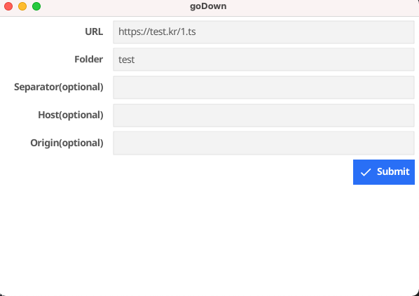

wonjinsin/goDown(cheetah)
============================
Simple rest api server with [Echo framework](https://github.com/labstack/echo)

[](http://opensource.org/licenses/MIT)

## Features
- [Fyne](https://github.com/fyne-io/fyne) : Platform for building graphical applications for desktop

## Project structure
Detached files(ex. ts) File downloader

## Getting started
```
# install
make vendor && make build
# start
make start
```

### Clean
```
$ make clean
```

## How to use
- Write first file url of detached file
- File is downloaded to repo folder

